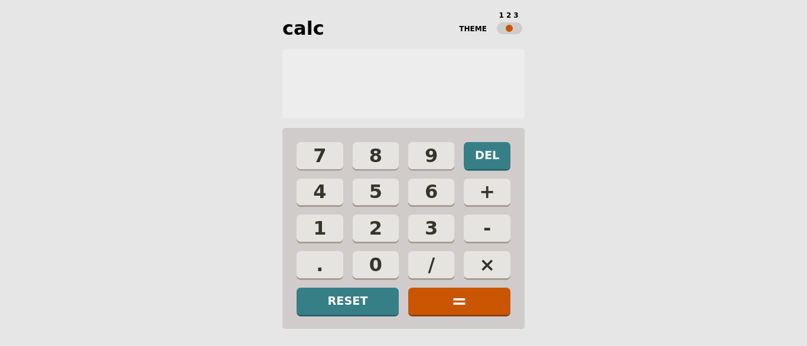
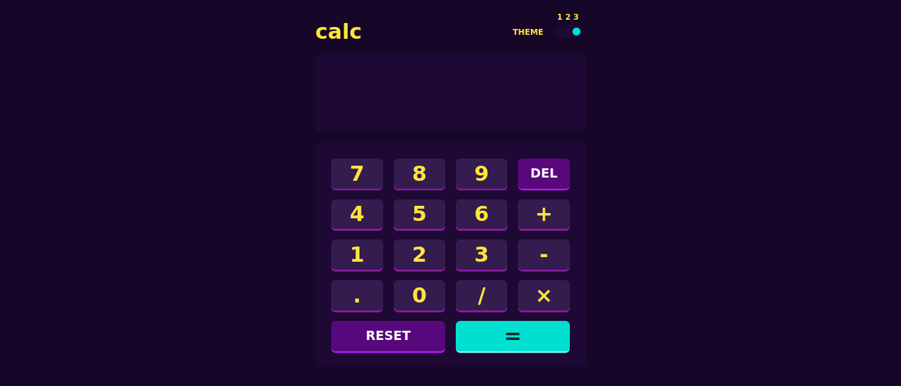

# Frontend Mentor - Calculator app solution

This is a solution to the [Calculator app challenge on Frontend Mentor](https://www.frontendmentor.io/challenges/calculator-app-9lteq5N29). Frontend Mentor challenges help you improve your coding skills by building realistic projects.

## Table of contents

- [Overview](#overview)
  - [The challenge](#the-challenge)
  - [Screenshot](#screenshot)
  - [Links](#links)
- [My process](#my-process)
  - [Built with](#built-with)
- [Author](#author)
- [Acknowledgments](#acknowledgments)

## Overview

- The calculator is built with simple html, css and vanilla javascript.
- It can do basic arthemetic operations.
- The user can also change the themes as they like.
- The web page is mobile responsive.

### The challenge

Users should be able to:

- See the size of the elements adjust based on their device's screen size
- Perform mathmatical operations like addition, subtraction, multiplication, and division
- Adjust the color theme based on their preference

### Screenshots

### Links

- You can check my Live Site here : https://calculator-using-js.netlify.app/

## My process

- I think my code is not that clean, but I'm trying to improve it.
- I felt that the project would be easier and I can do it in a couple of days, but I unable to complete it.
- I used sass instead of directly writing css.
- I used Object Oriented programming for the functionality of the calculator.
- I also learned how to make a toggle switch with just css. Before doing this project I have no idea how to style a radio button into a toggle switch.
- I also learned how to understand other people code as I looked in codepen for the styling of the toggle.
- I also never wrote a readme file before this and I have no idea how to write one.

### Built with

- Semantic HTML5 markup
- Sass
- CSS custom properties
- Flexbox
- CSS Grid

## Author

- Frontend Mentor - [@suryavivekofficial](https://www.frontendmentor.io/profile/suryavivekofficial)
- Twitter - [@suryavivek_ofcl](https://www.twitter.com/suryavivek_ofcl)
- LindedIn - [@Surya Vivek](https://www.linkedin.com/in/suryavivek/)
